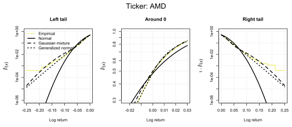
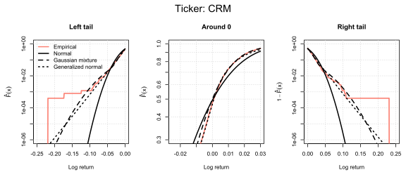
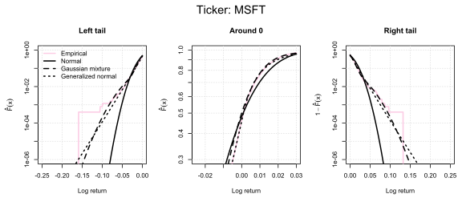
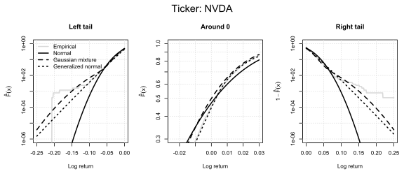
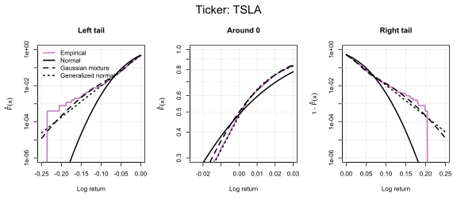

## Motivation

It is a very common practice in quantitative finance to assume that stock returns are normally distributed. However, it is usually hard to get a good Gaussian fit for the empirical return distribution. I decided to investigate this issue by performing statistical analysis of daily log-returns for 10 large U.S. companies over a 10-year period. 

I tested three candidate distributions:

1. The typical two-parameter normal distribution:

$$
\mathcal{N}(\mu, \sigma^2), \quad
f(x) = \frac{1}{\sqrt{2\pi\sigma^2}} \exp\left(-\frac{(x-\mu)^2}{2\sigma^2}\right).
$$

2. Two component gaussian mixture:

$$
f(x) = p \cdot \mathcal{N}(0, \sigma^2) + (1-p) \cdot \mathcal{N}(0, \beta^2),
$$

which is a two-state market model, i.e. the stock prices have higher or lower volatility with probabilities p and 1-p, respectively.

3. Generalized gaussian distribution:

$$
f(x) = \frac{\alpha}{2 \beta \, \Gamma(1/\alpha)} 
\exp\left(-\left|\frac{x-\mu}{\beta}\right|^{\alpha}\right),
$$


which is a three-parameter extension of the normal distribution.

## Data

- Daily share prices for 10 large U.S. technology companies
- Sample period: 2015–2025
- Data source: Yahoo Finance (downloaded using the `yfinance` Python package)
- Log-returns calculated from close prices

## Methods

- Evaluation of the empirical distribution with plots and moment estimation. 

- Implementation of **Maximum Likelihood Estimation (MLE)** method in **R**. 

- Estimation of parameters of Models 1, 2, and 3.

- **Likelihood ratio (LR)** statistical tests to asses whether:
    - the mean parameters differ significantly from 0 in Models 1 and 3 
    - the mixed Gaussian model an improvement compared to the normal model
    - the generalized Gaussian model an improvement compared to the normal model

## Maximum Likelihood Estimation results

Below you can click through fit results for the 10 chosen companies.

```{=html}
<div id="projectCarousel" class="carousel slide" data-bs-ride="false">
  <div class="carousel-indicators">
    <button type="button" data-bs-target="#projectCarousel" data-bs-slide-to="0" class="active" aria-current="true" aria-label="Slide 1"></button>
    <button type="button" data-bs-target="#projectCarousel" data-bs-slide-to="1" aria-label="Slide 2"></button>
    <button type="button" data-bs-target="#projectCarousel" data-bs-slide-to="2" aria-label="Slide 3"></button>
    <button type="button" data-bs-target="#projectCarousel" data-bs-slide-to="3" aria-label="Slide 4"></button>
    <button type="button" data-bs-target="#projectCarousel" data-bs-slide-to="4" aria-label="Slide 5"></button>
    <button type="button" data-bs-target="#projectCarousel" data-bs-slide-to="5" aria-label="Slide 6"></button>
    <button type="button" data-bs-target="#projectCarousel" data-bs-slide-to="6" aria-label="Slide 7"></button>
    <button type="button" data-bs-target="#projectCarousel" data-bs-slide-to="7" aria-label="Slide 8"></button>
    <button type="button" data-bs-target="#projectCarousel" data-bs-slide-to="8" aria-label="Slide 9"></button>
    <button type="button" data-bs-target="#projectCarousel" data-bs-slide-to="9" aria-label="Slide 10"></button>
  </div>

  <div class="carousel-inner">
    <div class="carousel-item active">
      
    </div>
    <div class="carousel-item">
      
    </div>
    <div class="carousel-item">
      
    </div>
    <div class="carousel-item">
      
    </div>
    <div class="carousel-item">
      
    </div>
    <div class="carousel-item">
      
    </div>
    <div class="carousel-item">
      
    </div>
    <div class="carousel-item">
      
    </div>
        <div class="carousel-item">
      
    </div>
        <div class="carousel-item">
      
    </div>
  </div>

  <button class="carousel-control-prev" type="button" data-bs-target="#projectCarousel" data-bs-slide="prev">
    <span class="carousel-control-prev-icon" aria-hidden="true"></span>
    <span class="visually-hidden">Previous</span>
  </button>

  <button class="carousel-control-next" type="button" data-bs-target="#projectCarousel" data-bs-slide="next">
    <span class="carousel-control-next-icon" aria-hidden="true"></span>
    <span class="visually-hidden">Next</span>
  </button>
</div>
```

To visually asses the fit performance in the tail sections of the distribution, refer to these plots:

```{=html}
<div id="projectCarousel2" class="carousel slide" data-bs-ride="false">
  <div class="carousel-indicators">
    <button type="button" data-bs-target="#projectCarousel2" data-bs-slide-to="0" class="active" aria-current="true" aria-label="Slide 1"></button>
    <button type="button" data-bs-target="#projectCarousel2" data-bs-slide-to="1" aria-label="Slide 2"></button>
    <button type="button" data-bs-target="#projectCarousel2" data-bs-slide-to="2" aria-label="Slide 3"></button>
    <button type="button" data-bs-target="#projectCarousel2" data-bs-slide-to="3" aria-label="Slide 4"></button>
    <button type="button" data-bs-target="#projectCarousel2" data-bs-slide-to="4" aria-label="Slide 5"></button>
    <button type="button" data-bs-target="#projectCarousel2" data-bs-slide-to="5" aria-label="Slide 6"></button>
    <button type="button" data-bs-target="#projectCarousel2" data-bs-slide-to="6" aria-label="Slide 7"></button>
    <button type="button" data-bs-target="#projectCarousel2" data-bs-slide-to="7" aria-label="Slide 8"></button>
    <button type="button" data-bs-target="#projectCarousel2" data-bs-slide-to="8" aria-label="Slide 9"></button>
    <button type="button" data-bs-target="#projectCarousel2" data-bs-slide-to="9" aria-label="Slide 10"></button>
  </div>

  <div class="carousel-inner">
    <div class="carousel-item active">
      
    </div>
    <div class="carousel-item">
      
    </div>
    <div class="carousel-item">
      
    </div>
    <div class="carousel-item">
      
    </div>
    <div class="carousel-item">
      
    </div>
    <div class="carousel-item">
      
    </div>
    <div class="carousel-item">
      
    </div>
    <div class="carousel-item">
      
    </div>
        <div class="carousel-item">
      
    </div>
        <div class="carousel-item">
      
    </div>
  </div>

  <button class="carousel-control-prev" type="button" data-bs-target="#projectCarousel2" data-bs-slide="prev">
    <span class="carousel-control-prev-icon" aria-hidden="true"></span>
    <span class="visually-hidden">Previous</span>
  </button>

  <button class="carousel-control-next" type="button" data-bs-target="#projectCarousel2" data-bs-slide="next">
    <span class="carousel-control-next-icon" aria-hidden="true"></span>
    <span class="visually-hidden">Next</span>
  </button>
</div>
```


## Conclusion

- The normal distribution provided a poor fit to the empirical return distribution. Is is especially visible in the tails, where it showed significant underestimation. 

- The Gaussian mixture model captured the distribution's tails substantially better. Its problem was underestimation in the central section around 0.

- The generalized Gaussian model, due to its flexibility, modelled the empirical distribution almost very well in all cases. 

The latter does not mean that GGD is immediately the best choice. With an increase in number of parameters, there is always a risk of overfitting to the sample, reducing the universality of results. In this case however, estimated GGD parameters were approximately the same for different companies, which suggest that this model is generalizable. 

Results of the statistical tests:
- for all 10 companies the means were not significantly different from 0. 
- Models 2 and 3 provided statistically significant improvements to Model 1. 

## Key Takeaways

- Normality of log-returns is not always a true assumption.
- Model selection depends on sample size and modelling objective:
    - Model 2 (mixture): preferable for small samples; captures tail behaviour while presenting an intuitive interpretation of parameters.
    - Model 3 (generalized): preferable for large samples if an accurate fit across the entire distribution is of interest. Overfitting risk must be considered. 


