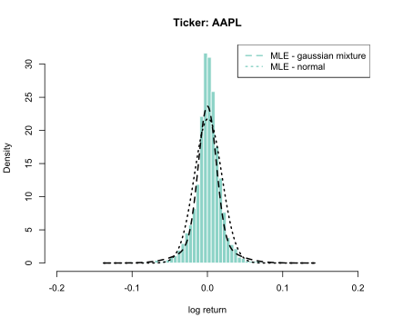
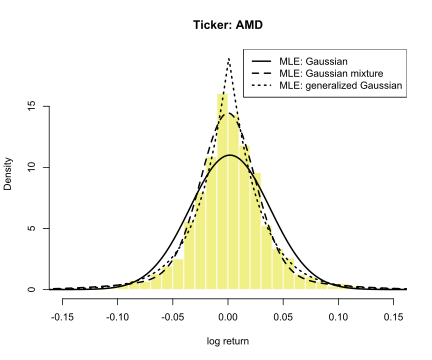
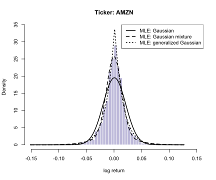
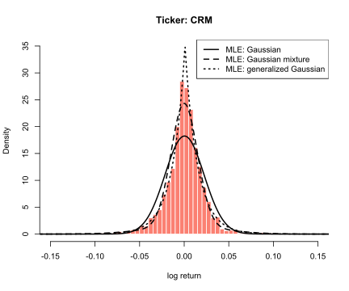
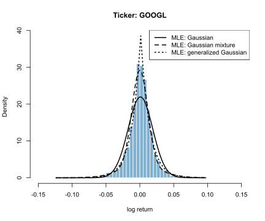
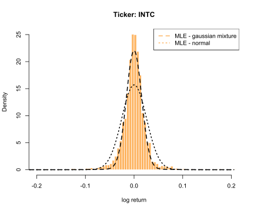
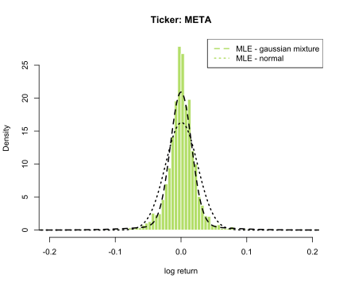
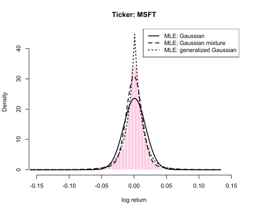
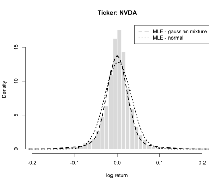
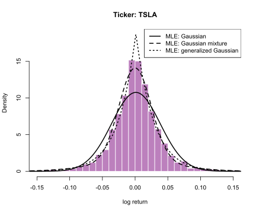

## Motivation

It is a very common practice in quantitative finance to assume that stock returns are normally distributed. However, empirical return distributions typically exhibit heavier tails and other qualities distinct from Gaussian distributions. I decided to investigate this issue by performing statistical analysis of daily log-returns for a time series of stock returns for 10 large U.S. companies. I compared fitting a normal distribution and fitting a two-component Gaussian mixture model to the data, with probability density defined as:

$$f(x) = p \cdot \mathcal{N}(0, \sigma^2) + (1-p) \cdot \mathcal{N}(0, \beta^2)$$ .

I chose this model because of its interesting interpretation: it is a two-state market model, where the market is in a "normal" state with volatility $\sigma$ with probability $p$, and in a "volatile" state with volatility $\beta$ with probability $1-\p$.

## Results of MLE distribution fitting

```{=html}
<div id="projectCarousel" class="carousel slide" data-bs-ride="false">
  <div class="carousel-indicators">
    <button type="button" data-bs-target="#projectCarousel" data-bs-slide-to="0" class="active" aria-current="true" aria-label="Slide 1"></button>
    <button type="button" data-bs-target="#projectCarousel" data-bs-slide-to="1" aria-label="Slide 2"></button>
    <button type="button" data-bs-target="#projectCarousel" data-bs-slide-to="2" aria-label="Slide 3"></button>
    <button type="button" data-bs-target="#projectCarousel" data-bs-slide-to="3" aria-label="Slide 4"></button>
    <button type="button" data-bs-target="#projectCarousel" data-bs-slide-to="4" aria-label="Slide 5"></button>
    <button type="button" data-bs-target="#projectCarousel" data-bs-slide-to="5" aria-label="Slide 6"></button>
    <button type="button" data-bs-target="#projectCarousel" data-bs-slide-to="6" aria-label="Slide 7"></button>
    <button type="button" data-bs-target="#projectCarousel" data-bs-slide-to="7" aria-label="Slide 8"></button>
    <button type="button" data-bs-target="#projectCarousel" data-bs-slide-to="8" aria-label="Slide 9"></button>
    <button type="button" data-bs-target="#projectCarousel" data-bs-slide-to="9" aria-label="Slide 10"></button>
  </div>

  <div class="carousel-inner">
    <div class="carousel-item active">
      
    </div>
    <div class="carousel-item">
      
    </div>
    <div class="carousel-item">
      
    </div>
    <div class="carousel-item">
      
    </div>
    <div class="carousel-item">
      
    </div>
    <div class="carousel-item">
      
    </div>
    <div class="carousel-item">
      
    </div>
    <div class="carousel-item">
      
    </div>
        <div class="carousel-item">
      
    </div>
        <div class="carousel-item">
      
    </div>
  </div>

  <button class="carousel-control-prev" type="button" data-bs-target="#projectCarousel" data-bs-slide="prev">
    <span class="carousel-control-prev-icon" aria-hidden="true"></span>
    <span class="visually-hidden">Previous</span>
  </button>

  <button class="carousel-control-next" type="button" data-bs-target="#projectCarousel" data-bs-slide="next">
    <span class="carousel-control-next-icon" aria-hidden="true"></span>
    <span class="visually-hidden">Next</span>
  </button>
</div>
```


## Data

- Daily prices for 10 large U.S. technology companies
- Sample period: 2015–2025
- Data source: Yahoo Finance (downloaded using the `yfinance` Python package)

## Methods

- Examined the empirical distribution with plots and method of moments estimation. 

- Implemented Maximum Likelihood Estimation (MLE) method in R. 

- Used MLE to estimate parameters for a normal model and a two-component normal mixture model. 

- Compared the fit results and performed likelihood ratio tests to evaluate the improvement in fit from the normal model to the mixture model.


## Results

The normal distribution provided a poor fit to the empirical return distribution.

The Gaussian mixture model captured the distribution substantially better, especially in the tails and in periods of elevated volatility. GMM estimation for the mixture model was numerically unstable because the relevant moment matrices became singular, so final inference for that specification relied on MLE.

{width=90% fig-align="center"}

## Key Takeaways

- Empirical stock returns were not well described by a single normal distribution.
- A two-component Gaussian mixture improved the fit substantially.
- The project highlights both statistical modeling and practical numerical issues in estimation.


## Materials

- [Academic report, incl. code (PDF)](projekt.pdf)
