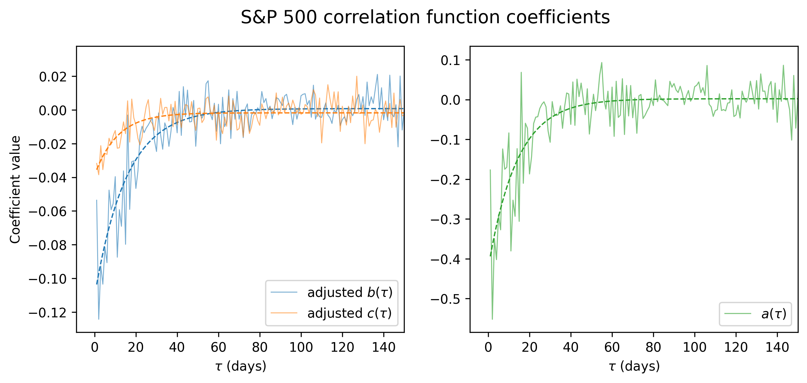
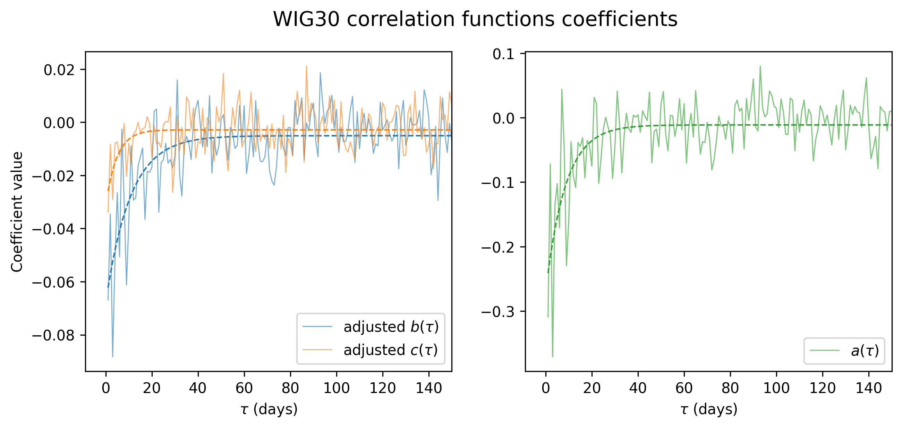

## Overview

This project investigates the correlation between returns and volatility in equity markets. It compares the **leverage effect (the increase in volatility that follows a negative return period)** on the Warsaw Stock Exchange (WSE) and the New York Stock Exchange (NYSE). The analysis is based on daily data for a sample period of 10 years, from 2016 to 2026.

## Motivation and source

The analysis is inspired by an academic article on quantitative analysis of the leverage effects in financial markets.

- **Reference article:** Reigneron, P.-A., Allez, R., & Bouchaud, J.-P. (2011). *Principal regression analysis and the index leverage effect*.
- **Project goal:** replicate the original analysis for S&P 500 index components, adapt the methodology to Polish WIG30 index components, compare the nature of stock price correlations between the two markets.

## Tools

- Python (libraries: pandas, numpy, matplotlib, seaborn, yfinance)
- Jupyter Notebook for data analysis and visualization

## Data

- **Stock price data:**  Yahoo Finance (via Python library yfinance)
- **Frequency:** daily
- **Number of companies:** 30 (for WIG30) and 500 (for S&P 500)
- **Sample period:** April 2016 to April 2026 (update of the original period used for 2025 conference)

### Preprocessing

- select the close prices and merge data for all stocks in each index
- manage missing observations date-wise and company-wise, eliminate entries with too many missing values
- calculate log returns
- normalize the returns 

## Methodology

Define:

- $r_{\alpha}(t)$ : return of stock $\alpha$ at time $t$
- $r^2_{\alpha}(t)$ : volatility of stock $\alpha$ at time $t$ 
- $I(t) = \frac{1}{N} \sum_{\alpha} r_{\alpha}(t)$ : average return at time $t$ (,,synthetic index return'')
- $I^2(t)$: proxy for index volatility at time $t$
- $\sigma^2(t) = \frac{1}{N} \sum_{\alpha} r^2_{\alpha}(t)$ : average stock volatility at time $t$
- $\rho(t) = \frac{1}{N(N-1)} \sum_{\alpha \neq \beta} r_{\alpha}(t) r_{\beta}(t)$ : average correlation of stock returns at time $t$

The authors propose two facts about the index volatility:

- general market fluctuations are driven by both volatility of individual stocks and by their correlations:
$$I^2(t) \approx \rho(t) \sigma^2(t)$$

- the collective measures, $I^2(t)$, $\sigma^2(t)$ and $\rho(t)$, depend on past returns via a linear relationship: 
    
    $$I^2(t) = I^2_0 +  a(\tau) \cdot I(t-\tau)$$
    $$\sigma^2(t) = \sigma^2_0 +  b(\tau) \cdot I(t-\tau)$$
    $$\rho(t) = \rho_0 +  c(\tau) \cdot I(t-\tau)$$

- the total influence of $I(t-\tau)$ on $I^2(t)$ is the sum of influences on $\sigma^2(t)$ and $\rho(t)$, which can be expressed as:

$$a(\tau) \approx b(\tau) \cdot \rho_0 + c(\tau) \cdot \sigma^2_0$$

To quantify these observations, the authors propose find the coefficients by standard linear regression for different time lags $\tau$.

## Results

The plots below show $a(\tau)$, $b(\tau) \cdot \rho_0$, and $c(\tau)\cdot \sigma^2_0$ values for time lags from 1 to 150 days. The influences from the left plot constitute the total influence in the right plot, as the authors suggest. 

{fig-align="center" width=700}

{fig-align="center" width=700}

In both markets, we clearly observe the leverage effect: if index returns decline, volatility measures and correlations between stocks increase, via the negative linear coefficients. We also observe that this effect decays over time, and after a period of several weeks it becomes random noise. 

We note 2 key differences between Polish and American markets:

1. The force of the negative correlation is stronger in the U.S. market than in the Polish market. This is most likely due to the fact that WSE is a smaller and less liquid market than NYSE, and therefore the collective behavior of stocks is less predictable and heavily influenced by idiosyncratic factors.
2. For similar reasons, the decay of the leverage effect is faster in the Polish market than in the American market. In the WSE, the effect becomes negligible after about 20 trading days, while in the NYSE it remains significant for up to 40 trading days. This suggests that shocks to the market have a more persistent impact on volatility and correlations in the U.S. market than in the Polish market.

This analysis shows, in a quantitative way, the unpredictability of Polish stock market compared to the American one. This is an important insight for investors and risk managers, as it implies that patterns observed in the model U.S market may not be directly applicable to smaller and more specific markets. 

## Conference poster

Below is the project poster presented at the 8th Warsaw School of Statistical Physics in 2025. It contains an extended analysis, including principal regression analysis. 
[Project poster (PDF)](financial_mathematics/leverage_effect/poster.pdf)

## Code

[View the code on GitHub](https://github.com/ma-latala/actuarial_projects/tree/main/projects/financial_mathematics/leverage_effect)

## Back

[Return to homepage](index.html)